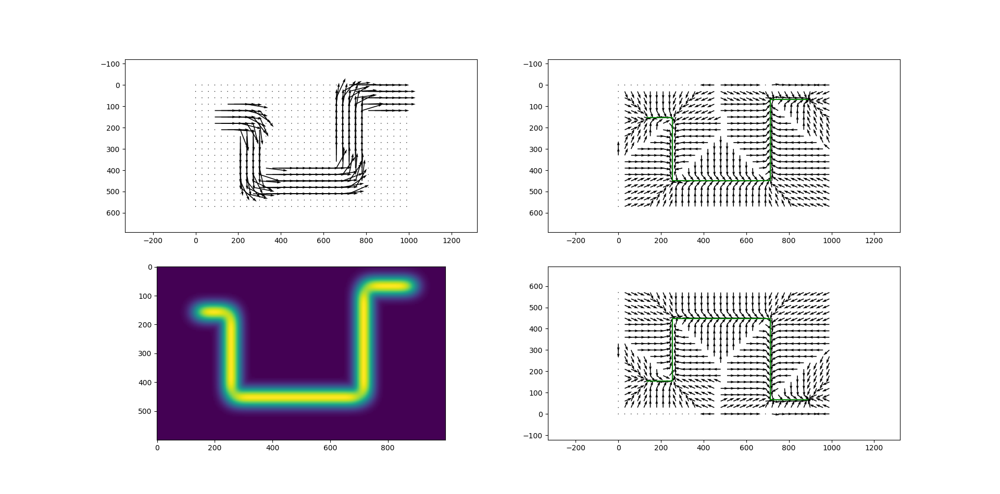
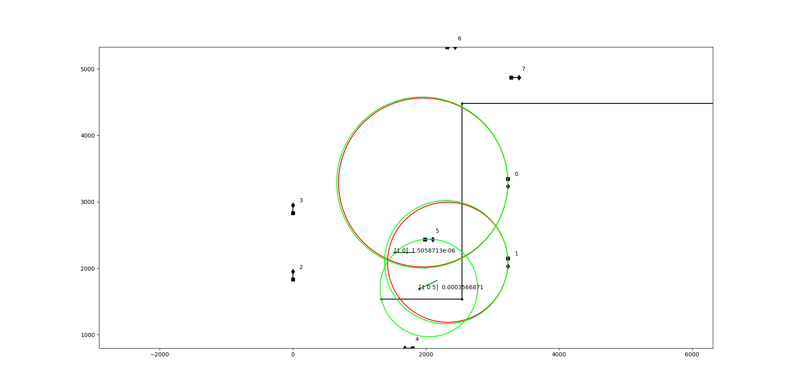

## Self-driving BUGGY  
It is buggy that works like this:  
https://www.youtube.com/watch?v=sZwu3c4jivI  
It is raw codes. The codes is numbered like t001 or tt001. It is order number in time. t001 are codes developed desktop. tt001 are codes that developed on raspbery pi.  
t001 or tt001 does not mean that I don't know how the git works. It just a way of research and development.  
It is a buggy based on Raspberry Pi. It has a camera and wheels. It use special QR-codes to define its place in a flat. It do some simple task: move from one room to another.  
Presentaion about own QR-codes: [see file raw_codes/qr-code-pres.pdf](./raw_codes/qr-code-pres.pdf)  

 
#### How it works:
It is a loop where 2 steps are made:  
1) Make photo, localize itself in a map, make decision on how to move
2) make small move.  
I do it in this way because otherwise it has blurry frames with QR codes and detection accuracy is low.  
  
How it localize itself:  
It has a map hardcoded inside the memory.  
The QR-codes have numbers 0 - 63.
The QR-codes are spread in the flat.  
After localization it moves according to predefined vector field: 

Each QR-code detected by 2 points.
Each QR-code gives a circle of possible locations.
Intersecion of circles is the position:
  
So wee need to see at least 2 codes to get the position.  
Depending on intersection of the circles localization error can be different and anisotropic.  
[Here is the formulas for localization error estimation.](./raw_codes/circle_width_formulas.jpg)  
[Here is differential steering formulas.](./raw_codes/rotation_formulas.jpg)  
Each wheel has an encoder. This gives an odometry data.  
Odometry data gives drift so the buggy requires to have 2 QR codes each 2-3 meters.  
22 QR codes where used.  
